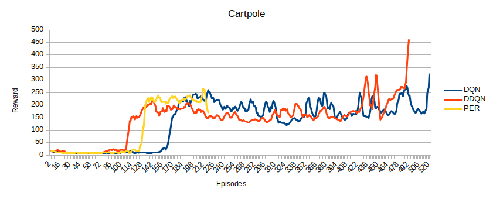

# Reinforcement Learning Papers implementation
Implementation of RL papers, tested in control tasks such as Cartpole. 
This project was done after having watched several lectures and read papers about Reinforcement Learning (RL), an area in which I have a deep interest in. The objective was to take what I had learned and apply it to a small but interesting problem. 
I decided to program an agent to learn how to solve Cartpole, using the [OpenAI Gym](https://gym.openai.com/docs/) environment, which facilitated the development. The RL techniques I programmed were _[Deep Q-Learning](https://deepmind.com/research/dqn/), [Double Deep Q-Learning](https://arxiv.org/abs/1509.06461) and [Prioritized Experience Replay](https://arxiv.org/abs/1511.05952)_. This was done using [Keras](https://keras.io/) as the framework to program the Neural networks, with Python as the programming language of choice.

## Results

The graphic above shows the results obtained at Cartpole for each implemented algorithm. The results were obtained using the median of five runs and smoothed with moving average. 

## Aknowledgements
Other than the linked papers, I have to thank Jaromir Janisch for his great [article](https://jaromiru.com/2016/11/07/lets-make-a-dqn-double-learning-and-prioritized-experience-replay/), which helped me a lot. I used his Sum Tree implementation, since it was pretty simple. 

## Future work
As soon as I get some free time, I would like to implement either a Policy gradient method (which seem successful in this kind of problems) or a more involved Q-Learning method such as the newly introduced [Rainbow method](https://arxiv.org/abs/1710.02298). 
